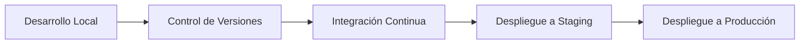
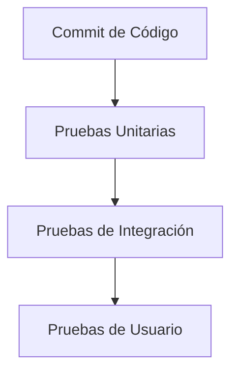
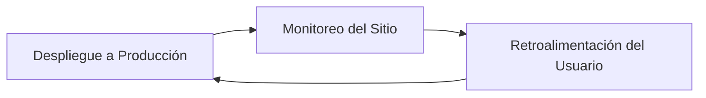

# Portafolio Personal
> Documentación del Proyecto de Sitio Web para portafolio personal.

## Descripción del Proyecto
Este proyecto tiene como objetivo la creación de un sitio web personal utilizando **Nuxt.js** para el enrutamiento y SSR, integrando **Vue.js** para la interactividad y **HTMLX** para mantener la simplicidad. El sitio será alojado permanentemente en **IPFS** utilizando **Fleek** para garantizar la durabilidad y accesibilidad del contenido.

## Fases del Proyecto

### Descripción de las Fases
1.  **Desarrollo Local**: El desarrollo se realiza utilizando **Visual Studio Code** con la configuración y extensiones adecuadas para trabajar con **Nuxt.js** y **Vue.js**.
    
2.  **Control de Versiones**: El código fuente se almacena en un repositorio de **GitHub**, con ramas dedicadas para desarrollo (`develop`) y producción (`main`).
    
3.  **Integración Continua (CI)**: La integración continua se gestiona mediante **GitHub Actions**, que automatiza la ejecución de pruebas y la generación de builds cada vez que se realiza un `commit`.
    
4.  **Despliegue a Staging**: Una vez que la CI ha sido aprobada, el código se despliega en un entorno de staging para realizar pruebas adicionales antes del despliegue en producción.
    
5.  **Despliegue a Producción**: El código aprobado se despliega en producción, utilizando **Fleek** para alojar el sitio en **IPFS**.

## Pipeline de Pruebas

### Detalle de las Pruebas
1.  **Pruebas Unitarias**: Validación de las funciones y componentes individuales del sitio, asegurando que funcionen como se espera.
    
2.  **Pruebas de Integración**: Verificación de que los distintos componentes del sitio interactúan correctamente entre sí.
    
3.  **Pruebas de Usuario**: Pruebas manuales realizadas en el entorno de staging para asegurarse de que la experiencia de usuario es la esperada.

## Despliegue y Monitoreo

### Proceso de Despliegue
1.  **Configuración de Fleek**: Creación y configuración del archivo `fleek.json` para definir la ubicación del directorio de salida y el comando de build.
    
2.  **Despliegue en IPFS**: Utilización de **Fleek CLI** para desplegar el sitio en **IPFS** y obtener el CID del sitio.
    
3.  **Monitoreo**: Implementación de herramientas de monitoreo para asegurarse de que el sitio esté funcionando correctamente y respondiendo a los usuarios.
    
4.  **Retroalimentación del Usuario**: Recopilación de comentarios de los usuarios para realizar mejoras continuas en el sitio.

## Estructura del Proyecto
	/
	├── assets/
	├── public/
	├── components/
	├── pages/
	│   └── index.vue
	├── app.vue
	├── nuxt.config.js
	└── package.json 

### Configuración de Nuxt.js para IPFS

La configuración del archivo `nuxt.config.js` es crucial para asegurar que el sitio funcione correctamente en IPFS:

	// nuxt.config.js
	export default defineNuxtConfig({
	  app: {
	    cdnURL: "./", // Asegura que los recursos se carguen correctamente en IPFS
	  }
	});

### Comando de Build
El comando utilizado para instalar las dependencias y generar la versión estática del sitio es:
`pnpm install && pnpm generate`

### Configuración de Fleek
	# Inicialización del sitio en Fleek
	fleek sites init

	# Despliegue del sitio en Fleek
	fleek sites deploy
